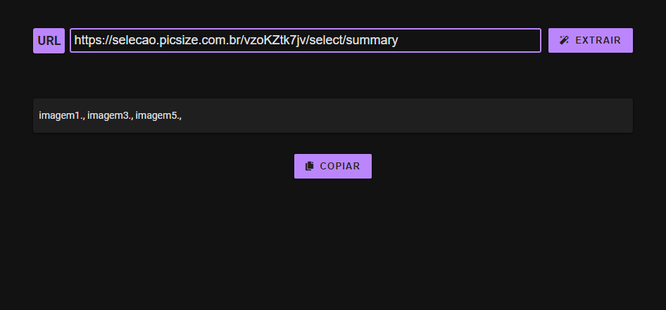
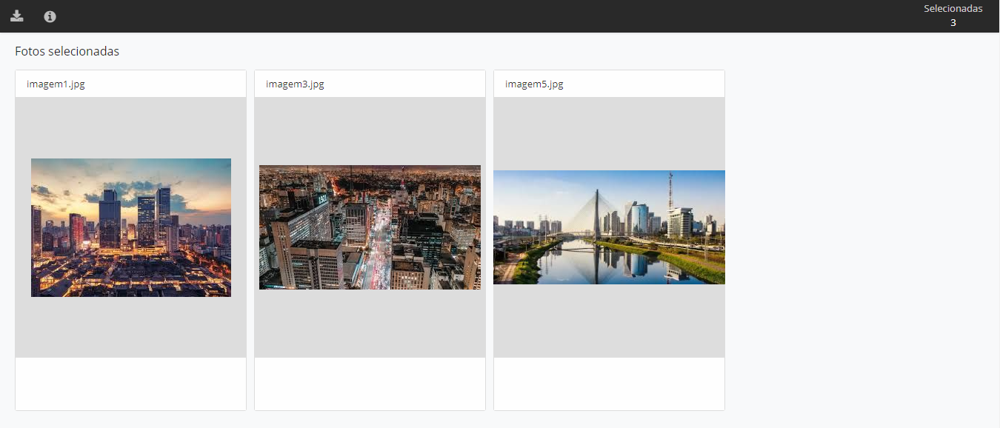
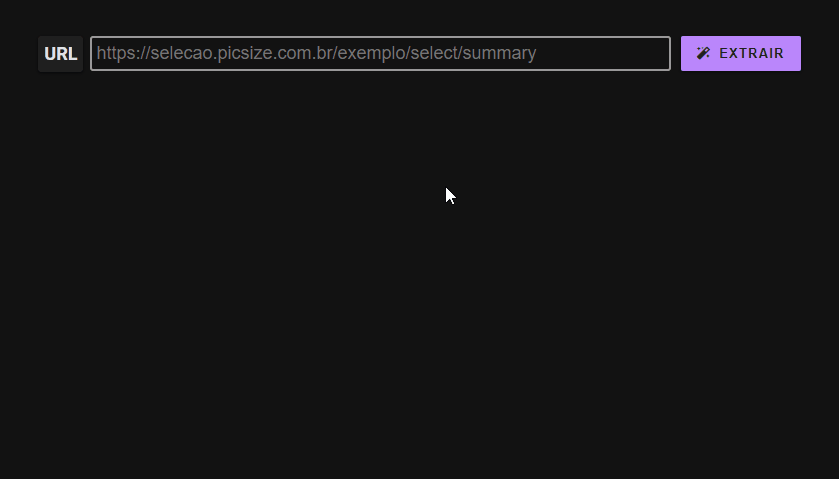

<h1 align="center">
  
   
  EXTRATOR DE NOME DE IMAGENS
</h1>

  

  

 
<h2>💡 Caso de Uso</h2>

  A plataforma <a href="https://picsize.com.br/" target="_blank">Picsize</a> gera uma galeria de imagens, sendo upadas pelo próprio usuário ou selecionadas por outro. Para pessoas que usam softwares como o Adobe Lightroom e querem editar apenas as imagens selecionadas pelo cliente é necessário usar um texto contendo o nome de cada imagem separados por vírgula e sem a extensão.

  

  

<h2>🚀 Tecnologias</h2>
<ul>
  <li>
    <a href="https://pt-br.reactjs.org/" target="_blank">React JS</a>
  </li>

  <li>
    <a href="https://nextjs.org/" target="_blank">Next JS</a>
  </li>

  <li>
    <a href="https://pptr.dev/#?product=Puppeteer&version=v5.5.0&show=api-class-puppeteer" target="_blank">Puppeteer</a>
  </li>

  <li>
    <a href="https://github.com/axios/axios" target="_blank">Axios</a>
  </li>

  <li>
    <a href="https://github.com/airbnb/lottie-web" target="_blank">Lottie</a>
  </li>

  <li>
    <a href="https://styled-components.com/" target="_blank">Styled Components</a>
  </li>

  <li>
    <a href="https://polished.js.org/" target="_blank">Polished</a>
  </li>

  <li>
    <a href="https://fkhadra.github.io/react-toastify/introduction" target="_blank">React Toastify</a>
  </li>
</ul>

<h2>📝 Licença</h2>

Este projeto está sob uma licença MIT. Veja mais informações em <a href="https://github.com/steferson-augusto/puppeteer-image-name/blob/main/LICENSE" target="_blank">LICENSE</a>.

---

👻 Criado por <a href="https://www.linkedin.com/in/st%C3%A9ferson-augusto-4b0b9b124/" target="_blank">Stéferson Augusto</a>

